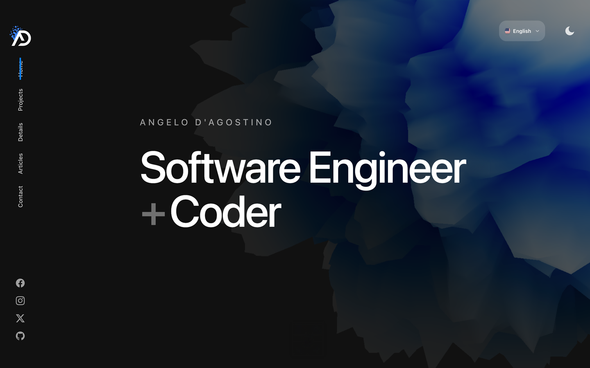

<p align="center">
  
</p>
<h1 align="center">Angelo D'Agostino - Software Engineer Portfolio</h1>



Personal portfolio of Angelo D'Agostino, showcasing projects and expertise in software engineering and design. Built with [Remix](https://remix.run/), [Three.js](https://threejs.org/), [Framer Motion](https://www.framer.com/motion/), featuring comprehensive internationalization support and modern web technologies.

## About

This portfolio showcases Angelo D'Agostino's work as a Software Engineer and Designer. The site features:

- **Modern Web Technologies**: Built with Remix 2.17, React 19, and TypeScript 5
- **3D Interactive Elements**: Powered by Three.js and React Three Fiber
- **Comprehensive Internationalization**: Full bilingual support (Italian/English) with:
  - Localized routing (`/en/articles`, `/it/articoli`)
  - Dynamic content translation using i18next
  - SEO-optimized multilingual URLs with hreflang tags
  - Localized date formatting
  - Language-specific article content
- **Database Integration**: Prisma ORM with PostgreSQL support
- **Component Library**: Interactive Storybook for design system
- **Performance Optimized**: Built with Vite 6 and deployed on Cloudflare Pages
- **Advanced Content Management**: MDX-powered multilingual blog system

## Install & run

Make sure you have Node.js `22.11.0` or higher and pnpm installed. Install dependencies with:

```bash
pnpm install
```

Once dependencies are installed, start up a local server with:

```bash
pnpm run dev
```

To view the components storybook:

```bash
pnpm run dev:storybook
```

## Database Setup

This portfolio includes database integration. To set up the database:

```bash
# Start the database (Docker)
pnpm run db:up

# Run migrations
pnpm run db:migrate

# Seed the database
pnpm run db:seed
```

## Deployment

The site is deployed on Cloudflare Pages. Deploy with:

```bash
pnpm run deploy
```

## Features

- **Responsive Design**: Mobile-first approach with modern CSS
- **Dark/Light Mode**: Theme switching with system preference detection
- **Interactive 3D**: Three.js models and animations
- **Admin Dashboard System** 🚧 **IN PROGRESS**:
  - Complete content management interface
  - Session-based authentication with role-based access control
  - Posts management (CRUD operations)
  - Multi-language admin interface with breadcrumbs
  - Categories, users, and settings management (planned)
  - Rich form interfaces with image gallery integration
- **Multilingual Blog System**:
  - MDX-powered articles with frontmatter support
  - Language-specific content (`hello-world.mdx` / `hello-world.it.mdx`)
  - Dynamic reading time calculation
  - Localized timecode display
  - SEO-friendly URL slugs per language
- **Advanced Internationalization**:
  - Route-based language detection (`/en/*`, `/it/*`)
  - Automatic date localization (21 April 2022 / 21 aprile 2022)
  - Content fallback system
  - hreflang SEO optimization
- **Contact Form**: AWS SES integration for contact functionality
- **SEO Optimized**: Meta tags, structured data, sitemap, and multilingual SEO

## Tech Stack

- **Frontend**: Remix 2.17, React 19, TypeScript 5
- **Styling**: CSS Modules, PostCSS, Tailwind CSS 4.1
- **3D Graphics**: Three.js, React Three Fiber, React Three Drei
- **Animation**: Framer Motion, GSAP
- **Database**: Prisma ORM, PostgreSQL
- **Internationalization**: i18next, react-i18next, remix-i18next
- **Content Management**: MDX with frontmatter, dynamic imports
- **Development**: Vite 6, Storybook, ESLint, Prettier
- **Testing**: Vitest, Testing Library
- **Deployment**: Cloudflare Pages, Wrangler
- **Package Management**: pnpm
- **DevOps**: Docker, Docker Compose

## Documentation

This project includes comprehensive documentation in the `docs/` folder:

- **[Admin Implementation Guide](docs/todo/admin-implementation.md)** - Complete roadmap and progress tracking for the admin dashboard system
- **[Internationalization Guide](docs/i18n-guide.md)** - Detailed guide on the multilingual system implementation
- **[Image Upload System](docs/image-upload-system.md)** - Documentation for media management and upload functionality
- **[Prisma Accelerate](docs/prisma-accelerate.md)** - Database optimization and acceleration setup

## License & Usage

This project is open source and available under the MIT License. You're welcome to use the code as a reference or starting point for your own portfolio. However, please:

- **Modify the design and content** to make it your own
- **Credit the original template** by Hamish Williams if using the design largely unmodified
- **Replace all personal content** (projects, images, text) with your own
- **Do not present the showcased projects as your own work**

## Contact

**Angelo D'Agostino**  
Software Engineer | Designer | Builder

- **Website**: [angelo-dagostino.com](https://www.angelo-dagostino.com)
- **GitHub**: [@iamadagostino](https://github.com/iamadagostino)
- **LinkedIn**: [iamadagostino](https://www.linkedin.com/in/iamadagostino)
- **Instagram**: [@iamadagostino](https://instagram.com/iamadagostino)
- **X**: [@iamadagostino](https://x.com/iamadagostino)

---

_"My Journey in Pixels and Ideas"_ ✨

## Project Architecture

### Internationalization System

This portfolio implements a comprehensive internationalization system:

- **Route Structure**: `/[lang]/[page]` format with fully localized URLs:
  - English: `/en/articles/hello-world`, `/en/contact`
  - Italian: `/it/articoli/ciao-mondo`, `/it/contatti`
- **Content Management**: Language-specific MDX files with fallback system
- **URL Localization**: Complete section localization (articles→articoli, contact→contatti, projects→progetti)
- **Date Localization**: Automatic formatting based on user's language (21 April 2022 / 21 aprile 2022)
- **Dynamic Loading**: Client-side component loading for optimal performance
- **SEO Optimization**: hreflang tags with proper localized URL references

### Blog System

The multilingual blog system features:

- **Frontmatter Support**: Title, abstract, date, banner metadata
- **Reading Time Calculation**: Automatic calculation based on content length
- **Timecode Display**: Professional timecode format (00:05:00:00)
- **Language Variants**: Support for localized articles with fallbacks
- **SEO Optimization**: hreflang tags and localized meta information

## Credits & Acknowledgments

This portfolio is built upon the excellent foundation created by **[Hamish Williams](https://hamishw.com)** ([GitHub: @HamishMW](https://github.com/HamishMW)). The original design and architecture provided an outstanding starting point that has been extensively customized and enhanced.

### Key Enhancements Made:

- Complete internationalization system with Italian/English support
- Advanced multilingual blog architecture
- Modernized build system (Remix 2.17, React 19, Vite 6)
- Database integration with Prisma and PostgreSQL
- Enhanced TypeScript implementation
- Docker containerization
- Extended component library

**Original Template**: [HamishMW/portfolio](https://github.com/HamishMW/portfolio)  
**Design Credit**: Hamish Williams - Outstanding UX/UI design and 3D implementation  
**Customization**: Angelo D'Agostino - Multilingual architecture and modernization

_Special thanks to Hamish for creating such a beautiful and well-architected foundation that made this enhanced portfolio possible._

## FAQs

<details>
  <summary>How do I access the admin dashboard?</summary>
  
  The admin system is currently in development. Once complete, you can access it at `/{lang}/admin/login` (e.g., `/en/admin/login`). The admin system includes:
  - Posts management with full CRUD operations
  - Multi-language interface
  - Image gallery integration
  - Categories, users, and settings management (planned)
  
  For detailed progress and implementation details, see the [Admin Implementation Guide](docs/todo/admin-implementation.md).
</details>

<details>
  <summary>How does the internationalization system work?</summary>
  
  This portfolio features a comprehensive i18n system with:
  - Route-based language detection (`/en/*`, `/it/*`)
  - Localized URLs (articles→articoli, contact→contatti)
  - Dynamic content translation with fallbacks
  - SEO optimization with hreflang tags
  
  For complete implementation details, see the [Internationalization Guide](docs/i18n-guide.md).
</details>

<details>
  <summary>Where can I find project documentation?</summary>
  
  All project documentation is located in the `docs/` folder:
  - [Admin Implementation Guide](docs/todo/admin-implementation.md) - Admin dashboard development progress
  - [Internationalization Guide](docs/i18n-guide.md) - Multilingual system implementation
  - [Image Upload System](docs/image-upload-system.md) - Media management documentation
  - [Prisma Accelerate](docs/prisma-accelerate.md) - Database optimization setup
</details>

<details>
  <summary>How do I change the color on the <code>DisplacementSphere</code> (blobby rotating thing in the background).</summary>
  
  You'll need to edit the fragment shader. [Check out this issue for more details](https://github.com/HamishMW/portfolio/issues/19#issuecomment-870996615).
</details>

<details>
  <summary>How do I get the contact form to work?</summary>
  
  To get the contact form working create an AWS account and set up SES (Simple Email service). Then plug in your details into `.dev.vars.example` and rename it to `.dev.vars`. You'll also need to add these as enviroment variables in the Cloudflare dashboard for it to work in production. Or if you don't mind sending through gmail use [nodemailer](https://nodemailer.com/) instead.
</details>
